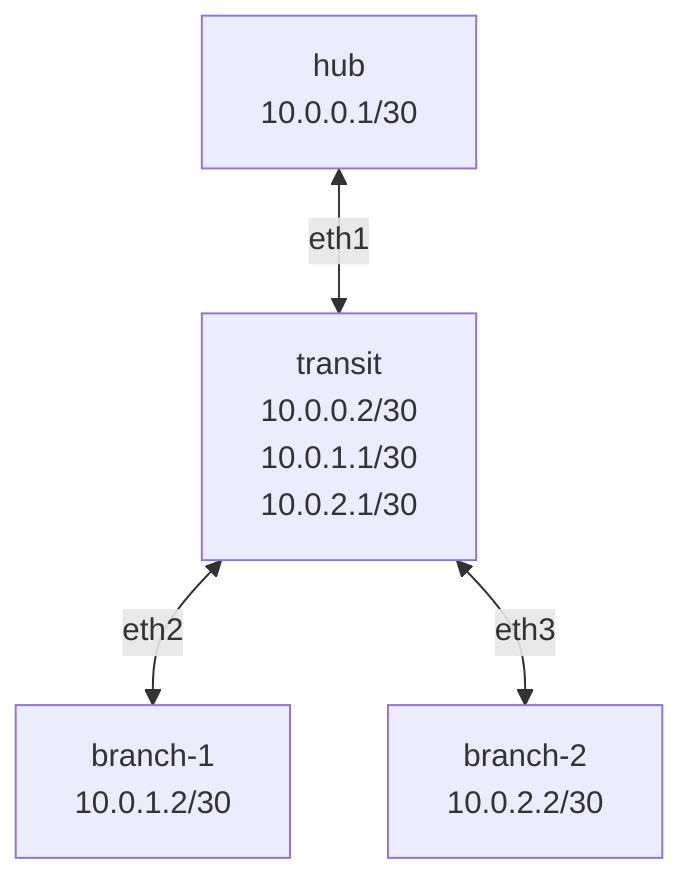
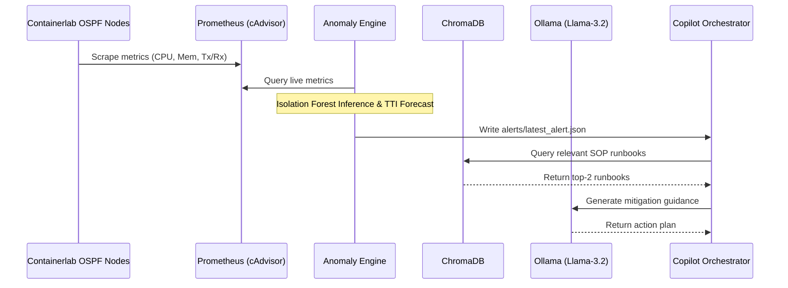

# Gap Moe

*Air-Gapped Predictive Network Operations Center (NOC) Copilot*

[](https://python.org)
[](https://containerlab.dev)
[](https://trychroma.com)
[](https://ollama.ai)

⭐ If you like this project, star it on GitHub!

[Intention](#intention) • [System Architecture](#system-architecture) • [Current Progress (v1)](#current-progress-v1) • [Getting Started &amp; Instructions](#getting-started--instructions) • [Testing &amp; Verification](#testing--verification) • [Roadmap](#roadmap)

---

A secure, offline, and air-gapped Predictive Network Operations Center (NOC) Copilot framework. `gap-moe` combines machine learning (Isolation Forests), real-time timeseries telemetry forecasting (linear regression), and Retrieval-Augmented Generation (RAG) using local LLM/embeddings to detect network anomalies, forecast time-to-impact, and automatically recommend precise mitigation commands.

It operates on top of a simulated dynamic OSPF hub-and-spoke topology managed by **Containerlab** and monitored with **Prometheus/cAdvisor**.

---

## Intention

In secure, high-availability, air-gapped network environments, traditional cloud-dependent AI tools are not an option. Network anomalies—such as link congestion, interface flapping, latency degradation, or routing engine memory leaks—require instant diagnostics and SOP (Standard Operating Procedure) runbook matching without exposing network data or configuration topologies to external endpoints.

`gap-moe` is built to resolve this by providing:

1. **Unsupervised Anomaly Detection**: Isolation Forests train locally on normal baseline telemetry to detect anomalous states without pre-defined static thresholds.
2. **Deterministic Forecasting**: Real-time trend projection via linear regression to predict the estimated Time-To-Impact (TTI) before a system failure (e.g., OOM or link capacity saturation) occurs.
3. **Retrieval-Augmented Generation (RAG)**: A local persistent vector database (ChromaDB) stores technical SOP runbooks and network topology context. When an alert fires, the top matching runbooks are retrieved.
4. **Local LLM Orchestration**: Combined with local network context, Ollama coordinates local models (`llama3.2:3b` and `nomic-embed-text`) to synthesize precise, step-by-step diagnostic hypotheses and container-level mitigation commands (such as OSPF dead-interval relaxation, traffic rate-limiting, or routing daemon reloads) for the NOC operator.

---

## System Architecture

The project consists of three core layers:



1. **Simulation & Telemetry Stack**:
   - Four virtual FRRouting (FRR) routers configured with OSPF routing across Area 0.
   - **cAdvisor** monitors container resource metrics (CPU, Memory).
   - **Prometheus** aggregates telemetry (CPU, Memory, and network traffic interface stats) in real-time.
2. **Predictive Analytics & Forecasting**:
   - `scripts/export_telemetry.py` periodically harvests scraped Prometheus metrics.
   - `scripts/train_models.py` builds Isolation Forest models for each individual router.
   - `scripts/predictive_engine.py` polls Prometheus, runs live anomaly inference, calculates TTI projection, and outputs active alert payloads.
3. **Offline Copilot Orchestrator (RAG)**:
   - `scripts/populate_kb.py` generates local vector representations of playbooks (`knowledge/`) and stores them in ChromaDB.
   - `scripts/copilot_orchestrator.py` watches for predictive alerts, queries ChromaDB, compiles the context prompt, and generates operator-friendly mitigation guides.



---

## Current Progress (v1.2)

- **Network Topology & Convergence [100%]**: Fully verified Containerlab OSPF topology. Static configuration templates, vtysh warning suppression, and dynamic neighbor adjacencies are operational.
- **Telemetry Integration [100%]**: Docker Compose telemetry services (cAdvisor and Prometheus) are configured with correct capability privileges to capture metrics and resolve OOM event tracking errors.
- **Predictive Engine [100%]**: Functional pipeline for telemetry export (`network_telemetry.csv`), machine learning model training, and continuous real-time forecasting.
- **RAG Knowledge Base [100%]**: ChromaDB vector storage populated with OSPF topology maps and Standard Operating Procedures (SOPs).
- **Copilot Orchestration [100%]**: LLM-guided agent successfully integrates local alert payloads with ChromaDB runbook retrievals to output precise troubleshooting command recommendations.
- **Interactive Dashboard & NOC Chaos Panel [100%]**: Fully deployed Streamlit dashboard with metric scaling, unit harmonization, full LLM context matching, and a master chaos injector reset toggle.
- **Security Hardening [100%]**: Implemented cryptographic model integrity checks (HMAC-SHA256), strict symlink/path traversal verification guards (`os.path.realpath`) in `populate_kb.py`, and XML-delimited prompt injection isolation constraints in `copilot_orchestrator.py` & `dashboard.py`.

---

## Getting Started & Instructions

### 1. Prerequisites

Ensure your host machine has the following tools installed:

- Docker and Docker Compose
- Containerlab (version 0.40+)
- Python 3.8+
- Ollama (running locally on default port `11434`)

Pull the necessary models in Ollama:

```bash
ollama pull nomic-embed-text
ollama pull llama3.2:3b
```

### 2. Environment Installation

Clone the repository and install Python dependencies:

```bash
python3 -m venv .gap
source .gap/bin/activate
# Make sure to install dependencies from requirements.txt
pip install -r requirements.txt
```

### 3. Deploying the Network Lab & Telemetry

1. **Deploy Containerlab**:
   ```bash
   sudo containerlab deploy -t clab/topology.clab.yml
   ```
2. **Start Monitoring Services**:
   ```bash
   docker compose -f telemetry/docker-compose.yml up -d
   ```
3. **Generate Traffic**:
   ```bash
   python3 scripts/traffic_generator.py start
   ```

### 4. Running the Predictive and Orchestration Engine

1. **Collect Baseline Metrics**:
   Allow the exporter to collect baseline traffic telemetry for a few minutes:

   ```bash
   python3 scripts/export_telemetry.py
   ```

   *(Exit with `Ctrl+C` when you have accumulated sufficient rows in `network_telemetry.csv`)*
2. **Train Anomaly Models**:

   ```bash
   python3 scripts/train_models.py
   ```

   *(This outputs trained `.pkl` models to `models/`)*
3. **Start the Predictive Inference Loop**:

   ```bash
   python3 scripts/predictive_engine.py
   ```

   *(This script polls Prometheus every 5 seconds, predicts anomalies, and writes to `alerts/latest_alert.json`)*
4. **Populate the Knowledge Base**:

   ```bash
   python3 scripts/populate_kb.py
   ```

   *(Encodes and indexes the markdown files from `knowledge/` into the local ChromaDB database `chroma_db/`)*
5. **Execute the Copilot Assistant (CLI)**:

   ```bash
   python3 scripts/copilot_orchestrator.py
   ```

   *(Retrieves the latest alert, matches SOP runbooks, queries `llama3.2:3b`, and formats the mitigation action recommendations)*

6. **Launch the Interactive Dashboard & NOC Chaos Panel**:

   For a unified operator experience, run the Streamlit dashboard:

   ```bash
   streamlit run dashboard.py
   ```

   This serves a production-grade UI at `http://localhost:8501`, featuring:
   - **NOC Chaos Panel (Sidebar)**: Start/Stop background traffic streams, inject network faults (congestion, flapping, latency degradation, memory leaks), toggle inference daemon, and trigger master resets.
   - **Dynamic Telemetry Observability**: Live charts for CPU usage, memory consumption, and transmit/receive bandwidth query metrics in real-time from Prometheus.
   - **Predictive System Warnings**: Status banners alerting operators to anomaly forecasts, severity levels, and Time-to-Impact projections.
   - **AI Copilot Orchestration**: RAG-driven remediation plan generator integrating the custom local vector index and Ollama models (`llama3.2:3b`) with prompt-hardening and unit scaling.
   - **Cryptographic Model Verification**: Live integrity check footer monitoring HMAC signatures on trained models.

---

## Testing & Verification

### Simulated Fault Injection (Chaos)

To test the end-to-end predictive alert and RAG copilot flow, you can inject various network issues using the chaos script:

```bash
# Inject 120ms latency delay on transit-branch2 interface
python3 scripts/chaos_injector.py degradation warn

# Inject link congestion (limits transit-hub link to 500Kbps)
python3 scripts/chaos_injector.py congestion warn

# Inject OSPF flapping packet drops (10% drop on transit-branch1)
python3 scripts/chaos_injector.py flapping warn

# Inject a memory leak inside the transit router container
python3 scripts/chaos_injector.py leak warn
```

To clean up all active network faults and return the simulation to normal:

```bash
python3 scripts/chaos_injector.py clear
```

---

## Roadmap

Planned enhancements for Version 2:

- 🎛️ **Playbook Schema Standardization**: Adopt a strict syntax schema in playbooks incorporating `Metadata`, `Diagnostics`, `Mitigation`, and `Rollback` keys.
- 🤖 **Auto-Remediation Execution**: Implement interactive confirmation options to execute the recommended commands directly on target Containerlab containers.
